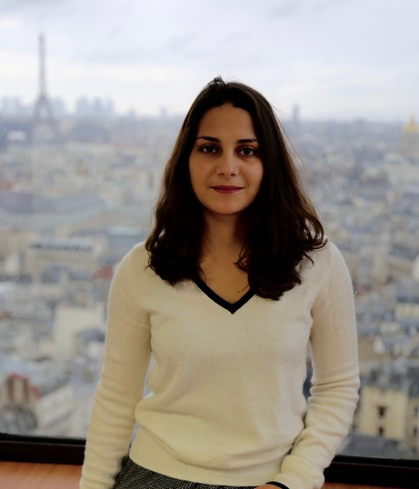

# **Manon Berriche**

-----------------

## [Research](research.md) • [Teaching](teaching.md) • [Science Popularization](General-Audience.md) • [Resume](https://drive.google.com/file/d/1syRqm-ya3dwk69_t_84dEMdOoiHAiZBB/view?usp=sharing)

-----------------

I am a PhD candidate at the [médialab of Sciences Po Paris](https://medialab.sciencespo.fr) and at the [Center for Research and Interdisciplinarity](https://www.cri-paris.org/en). I am working under the supervision of [Dominique Cardon](https://medialab.sciencespo.fr/en/people/dominique-cardon) and [Sophie Pène](https://www.dicen-idf.org/membre/pene-sophie) on the phenomenon of misinformation. The goal of my thesis is to assess how Internet users interact with fake news on social media and the extent to which different contexts of communication may spur different forms of reactions, as well as argumentation and evaluation strategies from lay people. To do so, I articulate approaches from media studies and cognitive psychology, and I complement digital methods — such as social network analysis and automatic textual analysis — with finer-grained examination of lay people's expressivity on social media.

## You can contact me at: 

* [manon.berriche@sciencespo.fr](manon.berriche@sciencespo.fr) 

## And I am also on: 

* [Twitter](https://twitter.com/berriche_manon)

* [Google Scholar](https://scholar.google.com/citations?user=vWrBYa4AAAAJ&hl=fr&oi=ao)

* [GitHub](https://github.com/manonberriche)

* [Linkedin](https://www.linkedin.com/in/manon-berriche)

* [Instagram](https://www.instagram.com/manonberriche)

